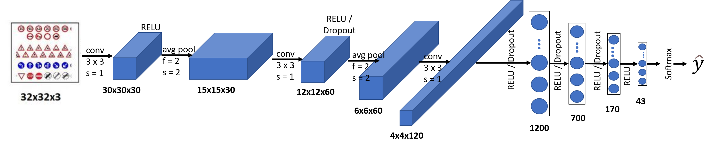

# **Traffic Sign Recognition** 

## Writeup

---

**Build a Traffic Sign Recognition Project**

The goals / steps of this project are the following:
* Load the data set (see below for links to the project data set)
* Explore, summarize and visualize the data set
* Design, train and test a model architecture
* Use the model to make predictions on new images
* Analyze the softmax probabilities of the new images
* Summarize the results with a written report

[//]: # (Image References)

 [image1]: ./graphs/training_set_distributuion.png "Visualization"

## Rubric Points
### Here I will consider the [rubric points](https://review.udacity.com/#!/rubrics/481/view) individually and describe how I addressed each point in my implementation.  

---
### Writeup / README

#### 1. Provide a Writeup / README that includes all the rubric points and how you addressed each one. You can submit your writeup as markdown or pdf. You can use this template as a guide for writing the report. The submission includes the project code.

You're reading it! and here is a link to my [project code](https://github.com/AlZi-88/SDCE_TrafficSignClassifier/blob/master/Traffic_Sign_Classifier.ipynb)

### Data Set Summary & Exploration

#### 1. Provide a basic summary of the data set. In the code, the analysis should be done using python, numpy and/or pandas methods rather than hardcoding results manually.

I used the numpy and python library to calculate summary statistics of the traffic
signs data set:

* The size of training set is 34799
* The size of the validation set is 4410
* The size of test set is 12630
* The shape of a traffic sign image is 32x32x3
* The number of unique classes/labels in the data set is 43

#### 2. Include an exploratory visualization of the dataset.

Here is an exploratory visualization of the training data set. It is a bar chart showing how the data is distributed over all existing classes. The x-axis is showing all classes from 0 to 42 and the y-axis is showing the number of images within each class.

![alt text][image1]

In the bar graph could be seen that the dataset is not very well distributed there are some classes with about 2000 images, where there are others with only about 200 images which is only about 10% of the others.

### Design and Test a Model Architecture

#### 1. Describe how you preprocessed the image data. What techniques were chosen and why did you choose these techniques? Consider including images showing the output of each preprocessing technique. Pre-processing refers to techniques such as converting to grayscale, normalization, etc. (OPTIONAL: As described in the "Stand Out Suggestions" part of the rubric, if you generated additional data for training, describe why you decided to generate additional data, how you generated the data, and provide example images of the additional data. Then describe the characteristics of the augmented training set like number of images in the set, number of images for each class, etc.)

As a first step, I normalized the data to have a mean of about 0. To do so first I normalized the data between zero and one and then as a second step I substraced the mean of each color channel from itself, to have a new mean around 0. I decided to keep the color channels and not to change into grayscale because I was hoping to keep more information in each image and to increase the accuracy by that measure.

#### 2. Describe what your final model architecture looks like including model type, layers, layer sizes, connectivity, etc.) Consider including a diagram and/or table describing the final model.

My final model consisted of the following layers, a visual scetch of the model architecture could be found below the table:

| Layer         		|     Description	        					| 
|:---------------------:|:---------------------------------------------:| 
| Input         		| 32x32x3 RGB image   							| 
| Convolution 3x3     	| 1x1 stride, VALID padding, outputs 30x30x20 	|
| RELU					|												|
| Max pooling	      	| 2x2 stride,  outputs 15x15x20 				|
| Convolution 3x3	    | 1x1 stride, VALID padding, outputs 12x12x60     									|
| RELU					|												|
| Dropout	      	|     				|
| Max pooling	      	| 2x2 stride,  outputs 6x6x60 				|
| Convolution 3x3	    | 1x1 stride, VALID padding, outputs 4x4x90     									|
| RELU					|												|
| Dropout	      	|     				|
| Fully connected		|  outputs 1140        									|
| RELU					|												|
| Dropout	      	|     				|
| Fully connected		|  outputs 1200        									|
| RELU					|												|
| Dropout	      	|     				|
| Fully connected		|  outputs 700        									|
| RELU					|												|
| Dropout	      	|     				|
| Fully connected		|  outputs 170        									|
| RELU					|												|
| Fully connected		|  outputs 43        									|

 

#### 3. Describe how you trained your model. The discussion can include the type of optimizer, the batch size, number of epochs and any hyperparameters such as learning rate.

To train the model, I used an [Adam Optimizer](https://www.tensorflow.org/api_docs/python/tf/keras/optimizers/Adam). My batches have an size of 256 and I am training in 40 epochs with a learning rate of 0.001. Before I was evaluating a batch size of 128 and 64 with slightly less accuracy. When I first trained my model I had difficulties with overfitting to the training data. To avoid this overfitting I added dropout in the model and used a factor of 0.5 during the training.

#### 4. Describe the approach taken for finding a solution and getting the validation set accuracy to be at least 0.93. Include in the discussion the results on the training, validation and test sets and where in the code these were calculated. Your approach may have been an iterative process, in which case, outline the steps you took to get to the final solution and why you chose those steps. Perhaps your solution involved an already well known implementation or architecture. In this case, discuss why you think the architecture is suitable for the current problem.

My final model results were:
* training set accuracy of 0.xxx
* validation set accuracy of 0.xxx 
* test set accuracy of 0.xxx

I started my modelwith the original [Lenet-model](https://en.wikipedia.org/wiki/LeNet). Since the model was initially designed to take (32x32x1) as input and not (32x32x3) I first had to adapt the model weights to match the current configuration. Same was necessary for the output classes. While testing I was not relly satisfied with the results. I assumed this was caused by the limited number of parameters inside of the model. Initially the model was designed to detect the numbers from 0-9, I have to detect 43 output classes. Also the input is very different and has two additional color channels. So in total the information to precess and predict is much higher. So I decided to add an additional layer and also to increase the depth of each layer.

This step was quite effective and my training accuracy was increasing. Unfortunately I had to deal with overfitting on the training set at this point, which lead me to the decision to add dropout in the model.

Once the design was fixed I varied the hyperparameters, especially learning rate and number of epochs. I tried learning rates from 0.1 to 0.0005 and number of epochs from 10 to 70. Finally with the setting of a learning rate of 0.001 and 20 epochs I could achieve the best mix of accuracy and training time.
 
Even with these measures my model was badly overfitting (94% vs. ~80% accuracy), so I had to modify my training data. To do so I used two techniques to balance my training data set. As a base I used a mix between random oversampling and random undersampling to get a balanced base data set which has 430 images per class. This already makes the model more robust since it sees for each class a equal number of images for training. To virtually increase the training data I also used to oversize image dataset to add augmentations. The augmentations I added is random rotation, random color modifications and random zooming. After all these modifications my dataset contains 364210 images, instead of 34799 before. I decided not to use fliping measures as augmentation, simply because a right arrow image has a completely different meaning after flipping it from left to right. 

### Test a Model on New Images

#### 1. Choose five German traffic signs found on the web and provide them in the report. For each image, discuss what quality or qualities might be difficult to classify.

Here are five German traffic signs that I found on the web:

These images show the traffic signs only without any background from real world, like it is in the traaining set, which contains real images from theroad.

#### 2. Discuss the model's predictions on these new traffic signs and compare the results to predicting on the test set. At a minimum, discuss what the predictions were, the accuracy on these new predictions, and compare the accuracy to the accuracy on the test set (OPTIONAL: Discuss the results in more detail as described in the "Stand Out Suggestions" part of the rubric).

Here are the results of the prediction:

| Image			        |     Prediction	        					| 
|:---------------------:|:---------------------------------------------:| 
| Slippery road    		| Double curve							| 
| Priority road     			| Priority road 										|
| No passing					| No entry											|
| Stop	      		| Keep right					 				|
| Right-of-way at the next intersection			| Right-of-way at the next intersection      							|

The model was able to correctly guess 2 of the 5 traffic signs, which gives an accuracy of 40%. Which does not really correspond to the results before. One reason for this might be that most of the images include the signs only without any background which is completely different to the other data. This might have been something the model wasn't able to handle.

#### 3. Describe how certain the model is when predicting on each of the five new images by looking at the softmax probabilities for each prediction. Provide the top 5 softmax probabilities for each image along with the sign type of each probability. (OPTIONAL: as described in the "Stand Out Suggestions" part of the rubric, visualizations can also be provided such as bar charts)

The code for making predictions on my final model is located in the 19th cell of the Ipython notebook.

In the image below the top 5 prediction probabilities for each image are plotted.
For the 'priority road'- and 'right-of-way at the next intersection"-signs the model is very certain about it's result and the result is correct for these ones. For the "no passing"-sign the model is also very certain about the result but in this case the result is wrong. The other two results the model is quite uncertain about it's result.

In a next step I will update the training data to have a better distribution in it. I guess this is the most effective measure to further improve the model accuracy.

